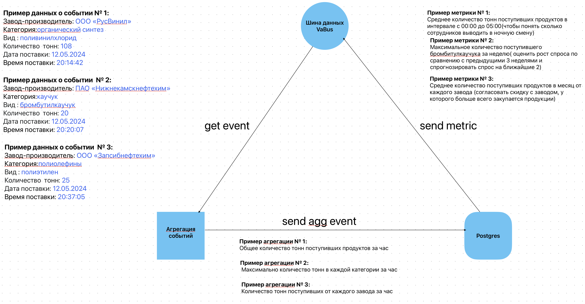

## Название проекта: 

"From event to metric"

## Что делает проект:

 Получает события из шины данных VaBus -> 
 Агрегирует события по функциям и времени ->
 Отправляет агрегированные события в Postgres ->
 Отправляет метрики в шину данных VaBus
 

## Почему проект полезен:
 
Проект полезен тем, что использует асинхронность, экономя время исполнения процессов.
Мы быстрее получаем новые метрики и можем оперативнее реагировать и вносить корректировки 
в рабочие процессы для эффективности и увеличения показателей прибыли.

